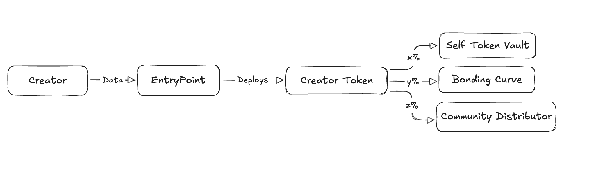

# Protocol

The protocol’s architecture is divided into three main sections:

1. **EntryPoint**
2. **Creator Token**
3. **Token Economy**

---

## 1. EntryPoint

**Purpose:**
- Acts as a single, reliable onboarding entry point for creators.
- Maintains a registry mapping a hashed Twitter/X handle to the deployed Creator Token contract.
- Stores information about the supported AI agents that token creators can use for token distribution.
- Ideally implemented as an NFT contract that deploys Creator Token contracts as NFTs, providing a fraud‑proof record.

**Benefits:**
- Enables any creator to easily create their token contract.
- Allows the protocol to update or manage the list of supported AI agents.
- Provides a unified integration point for the frontend.

---

## 2. Creator Token

**Overview:**
- Deployed via the EntryPoint, this contract is minted as an NFT and contains both ERC20 and additional NFT features.
- Serves as a fraud‑proof record by embedding critical information, such as the creator’s details and the addresses of the underlying Token Economy contracts.
- Functions as a standard ERC20 token while also storing metadata (e.g., token contract address, creator information) through mappings linking token IDs to metadata and token contract addresses to token IDs.

**Key Features:**
- **Metadata Storage:**  
  Stores details like the token contract address and creator information within its NFT metadata.
- **ERC20 with Built‑in Fraud Proof:**  
  Points to three sub‑contracts (detailed in the Token Economy section):
  - **x – SelfTokenVault**
  - **y – Bonding Curve**
  - **z – Distributor Contract**

---

## 3. Token Economy

The Token Economy is modular and comprises three separate contracts, each responsible for a different aspect of token distribution and market liquidity.

### 3.1 SelfTokenVault

**Purpose:**
- Holds the creator’s personal token allocation (x%).

**Features:**
- Stores the designated x% of tokens until the creator withdraws them.
- Provides secure withdrawal functionality for the creator.

---

### 3.2 Bonding Curve

**Purpose:**
- Facilitates immediate market liquidity by making tokens available for free-market trading.

**Features:**
- Holds the market supply (y% of tokens).
- Enables users to buy and sell tokens via a bonding curve mechanism.
- Exposes details regarding the deployed bonding curve for transparency.

---

### 3.3 Distributor Contract

**Purpose:**
- Manages the controlled, time‑based distribution of tokens (z%).

**Features:**
- Holds the distributor allocation (z% of tokens) for scheduled distribution.
- Implements logic to distribute tokens over a predetermined number of days (e.g., if there are N days and 1M tokens, then `1M/N` tokens are distributed per day).
- Is managed by the designated AI agent, ensuring that the distribution is automated and reliable.

---

## Summary

- **EntryPoint:**  
  Acts as an NFT-based factory and registry. It allows creators to deploy a Creator Token contract while maintaining a secure, immutable record (via a non-transferable NFT) of each deployment. It also manages a registry of supported AI agents.

- **Creator Token:**  
  Functions as both an ERC20 token and an NFT. It stores critical metadata (including links to the Token Economy contracts) to provide fraud‑proof evidence of token distribution and creator details.

- **Token Economy:**  
  Comprises three distinct contracts:
  - **SelfTokenVault (3.1):** For holding the creator’s own tokens.
  - **Bonding Curve (3.2):** For immediate market liquidity and trading.
  - **Distributor Contract (3.3):** For time‑based token distribution managed by an AI agent.

This modular architecture ensures transparency, fraud-proofing, and efficient token distribution while providing a single, unified entry point for creators.
