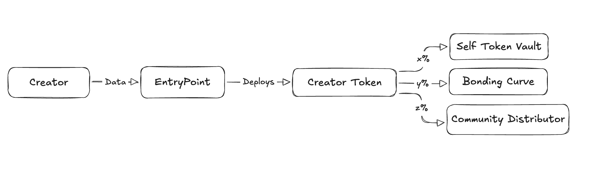

## Protocol 



The contract architecture has 3 main sections one is entryPoint, creator token and third is creator token supporter 

ideally the entryPoint will store all the information about which are the AI agents that token creators can use to distribute tokens then the mapping of hash of twitter x to the creator token contract address 
while the creator token contract is a NFT type of contract which has metadata.
This contract has actual token erc20 and all the information about creator and all while it points towards 3 contracts further the x,y,z thing the x is selfTokenVault, y is market supply to get to know where the bonding curve is deployed and teh z is token distributor contract by AI agent

Why entrypoint?
Allows any creator to create the token contract and we as a protocol can update the AI agents we support the creators that has been onboarded and overall a single entry point for frontend reliable and easy to integrate. Ideally the entry point is a NFT contract that actually deploys creator token contract as NFTs 

Why Creatortoken?
This are actually NFTs minted by entryPoint of our Attenomics contracts
This contract itself is a ERC20 contract with addtional features like built in NFT that can be used to raise fraud proof against any token distribution as this allows us to get the swapping bonding curve contract details and the distributor contract details of AI agent and the selftoken vault contract details seperately 

What is Distributor contract?
This contract basically holds the token which will be distributed over N days so how we calculate is suppose that there are N days and we got 1M tokens it means that everyday 1M/N tokens can be distributed and the distributor can be only ai agent for now 

What is Bonding curve?
This contract makes the token available instantly for free market where they can buy and sell the tokens on bonding curve 

## Foundry

**Foundry is a blazing fast, portable and modular toolkit for Ethereum application development written in Rust.**

Foundry consists of:

-   **Forge**: Ethereum testing framework (like Truffle, Hardhat and DappTools).
-   **Cast**: Swiss army knife for interacting with EVM smart contracts, sending transactions and getting chain data.
-   **Anvil**: Local Ethereum node, akin to Ganache, Hardhat Network.
-   **Chisel**: Fast, utilitarian, and verbose solidity REPL.

## Documentation

https://book.getfoundry.sh/

## Usage

### Build

```shell
$ forge build
```

### Test

```shell
$ forge test
```

### Format

```shell
$ forge fmt
```

### Gas Snapshots

```shell
$ forge snapshot
```

### Anvil

```shell
$ anvil
```

### Deploy

```shell
$ forge script script/Counter.s.sol:CounterScript --rpc-url <your_rpc_url> --private-key <your_private_key>
```

### Cast

```shell
$ cast <subcommand>
```

### Help

```shell
$ forge --help
$ anvil --help
$ cast --help
```
# contracts
